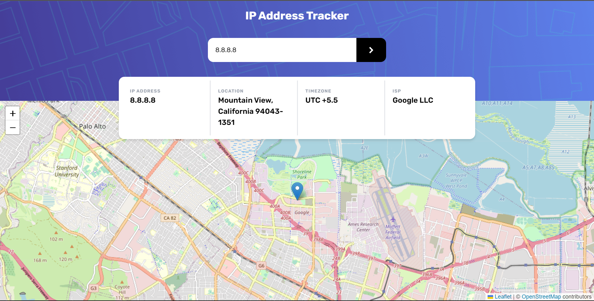

# Frontend Mentor - IP address tracker solution

This is a solution to the [IP address tracker challenge on Frontend Mentor](https://www.frontendmentor.io/challenges/ip-address-tracker-I8-0yYAH0).

# Screenshot

# Links

- Live Site URL: [track-ipaddress.netlify.app](https://track-ipaddress.netlify.app/)

# Built with

- Semantic HTML5 markup
- [Tailwind CSS](https://tailwindcss.com/) - CSS Framework
- Flexbox
- CSS Grid
- Mobile-first workflow
- [LeafletJS](https://leafletjs.com/)
- [React](https://reactjs.org/) - JS library
